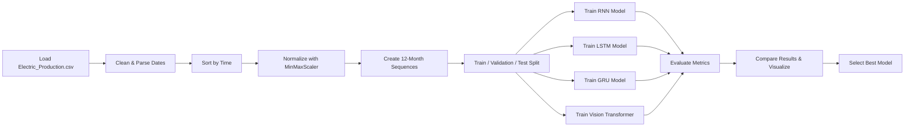

# Assignment 07 — Electric Production Forecasting using Deep Learning

## Overview

This project performs **time-series forecasting** on monthly electric production data using multiple deep learning architectures implemented in **PyTorch**. The goal is to predict future production values from historical observations and compare model performance.

## Dataset

* **File:** `Electric_Production.csv`
* **Frequency:** Monthly
* **Period:** 1985–2018
* **Target Variable:** `Production`

## Models Implemented

1. Recurrent Neural Network (**RNN**)
2. Long Short-Term Memory (**LSTM**)
3. Gated Recurrent Unit (**GRU**)
4. Vision Transformer (**ViT**) adapted for time-series patches

## Workflow



## Results

| Model              |        MAE |       RMSE |     MAPE |         R² |
| ------------------ | ---------: | ---------: | -------: | ---------: |
| RNN                |     3.0235 |     4.4279 |     2.84 |     0.7966 |
| LSTM               |     8.0606 |     9.5506 |     7.95 |     0.0537 |
| GRU                |     3.6874 |     4.9915 |     3.47 |     0.7415 |
| Vision Transformer | **2.9292** | **4.2748** | **2.73** | **0.8104** |

### Best Model

🏆 **Vision Transformer** achieved the best performance across all evaluation metrics.


## 📊 Results & Visualizations

### 1. Predictions vs Actual Values
Shows how each model tracks real electric production values.


**Insight:** Vision Transformer and RNN follow the actual trend most closely, while LSTM underfits.

---

### 2. Error Metrics Comparison
Comparison of MAE, RMSE, and MAPE across all models.


**Insight:** Vision Transformer achieved the lowest forecasting errors.

---

### 3. Training & Validation Loss Curves
Loss convergence across training epochs.


**Insight:** Vision Transformer converged faster with stable validation loss.

---

### 4. Best Performing Model
🏆 **Vision Transformer**
- Lowest MAE
- Lowest RMSE
- Lowest MAPE
- Highest R² Score


## Key Findings

* Transformer-based architecture handled long-range dependencies effectively.
* RNN and GRU performed competitively.
* LSTM underperformed on this configuration.
* Proper sequence creation and normalization were essential.

## Technologies Used

* Python
* NumPy
* Pandas
* Matplotlib
* Seaborn
* Scikit-learn
* PyTorch

## How to Run

```bash
pip install numpy pandas matplotlib seaborn scikit-learn torch jupyter
jupyter notebook
```

Then open `Assignment timeseries.ipynb` and run all cells.

## File Structure

```text
Assignment timeseries.ipynb
README.md
Electric_Production.csv
```

## Conclusion

This project demonstrates how different neural architectures perform on time-series forecasting. The **Vision Transformer** delivered the most accurate forecasts for monthly electric production.
