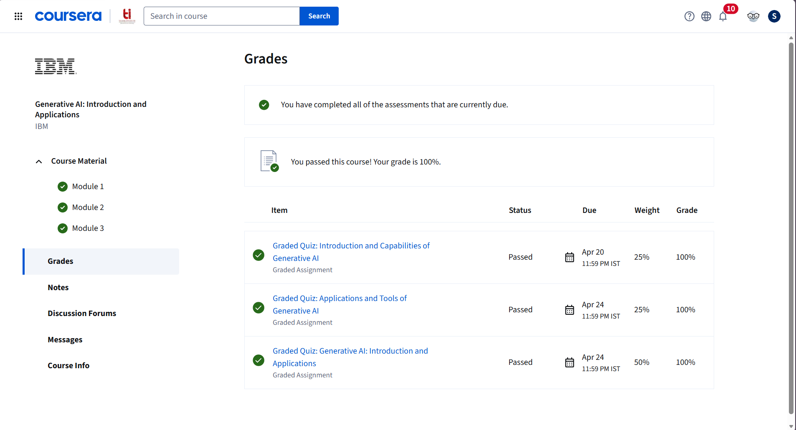

# Course 1: IBM - Generative AI: Introduction-and-Applications

**Platform:** Coursera | **Provider:** IBM  
**Course Link:** [Generative AI: Introduction and Applications](https://www.coursera.org/learn/generative-ai-introduction-and-applications)   
**Certificate:** [View](https://github.com/samiksha-bansal1/Deep-Learning-UCS761/blob/main/Coursera-IBM/Course-1-Generative-AI-Introduction-and-Applications/certificate.pdf)

---

## 📸 Graded Assignment Screenshots

---

## 📖 Topics Covered

- Fundamental concepts of generative AI and its core models
- Foundation models in generative AI
- Capabilities of pre-trained models for AI-powered applications
- Generative AI platforms — IBM watsonx and Hugging Face
- Generative Adversarial Networks (GANs)
- Large Language Modeling (LLM)
- Prompt Engineering
- Natural Language Processing