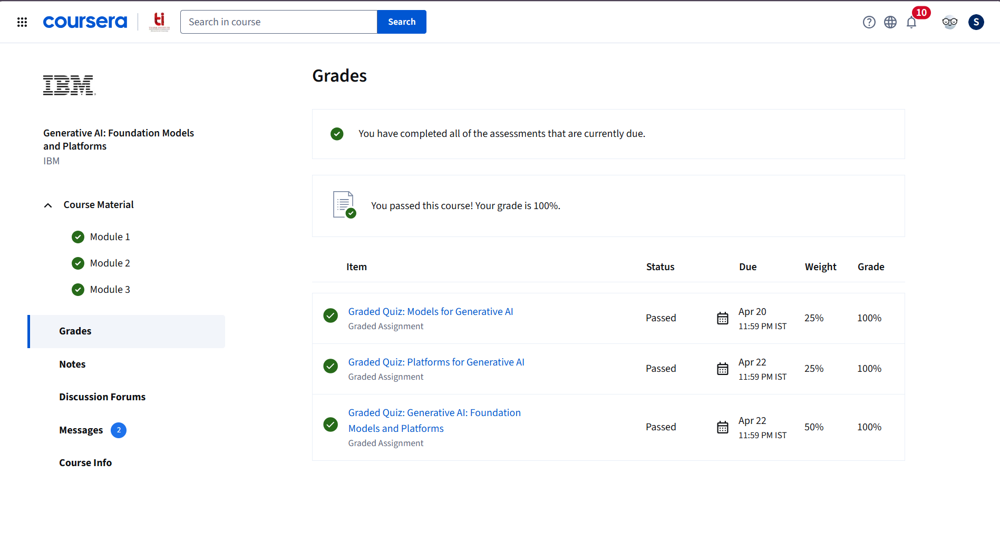

# Course 2: IBM - Generative AI: Introduction and Applications

**Platform:** Coursera | **Provider:** IBM  
**Course Link:** [Generative AI: Introduction and Applications](https://www.coursera.org/learn/generative-ai-introduction-and-applications)  
**Certificate:** [View](https://github.com/samiksha-bansal1/Deep-Learning-UCS761/blob/main/Coursera-IBM/Course-2-Generative-AI-Foundation-Models-and-Platforms/certificate.pdf)

---

## 📸 Graded Assignment Screenshots

---

## 📖 Topics Covered

- Generative AI vs Discriminative AI
- Capabilities of generative AI and real-world use cases
- Applications of generative AI across different sectors and industries
- Generative AI models and tools for text, code, image, audio, and video generation
- ChatGPT and other generative AI tools
- Deep Learning and Machine Learning foundations